# MoneyRAG - Personal Finance Transaction Analysis

AI-powered financial transaction analysis using RAG (Retrieval-Augmented Generation) with Model Context Protocol (MCP) integration.

## Features

- **Smart CSV Ingestion**: Automatically maps any CSV format to standardized transaction schema using LLM
- **Multi-Provider Support**: Works with Google Gemini and OpenAI models
- **Merchant Enrichment**: Automatically enriches transactions with web-searched merchant information
- **Dual Storage**: SQLite for structured queries + Qdrant for semantic search
- **MCP Integration**: Leverages Model Context Protocol for tool-based agent interactions
- **Interactive UI**: Streamlit-based web interface for chat-based analysis
- **Dockerized**: Complete containerized deployment ready for production

## Architecture

```mermaid
%%{init: {'theme': 'base', 'themeVariables': { 'primaryColor': '#fff', 'primaryBorderColor': '#333', 'primaryTextColor': '#333', 'lineColor': '#666' }}}%%

graph TD
    %% --- Top Layer: Entry Point ---
    subgraph UI["💻 User Interface"]
        Streamlit["🌐 Streamlit Web App<br/><i>Interactive Dashboard</i>"]
    end

    %% --- Middle Layer: Split Processes ---
    
    %% Left Column: Ingestion (The Write Path)
    subgraph Ingestion["📥 Data Pipeline (Write)"]
        direction TB
        CSV["📄 CSV Upload<br/><i>Raw Data</i>"]
        Mapper["🧠 LLM Mapper<br/><i>Schema Norm.</i>"]
        Enrich["🔍 Web Enrich<br/><i>DuckDuckGo</i>"]
        
        CSV --> Mapper
        Mapper --> Enrich
    end

    %% Right Column: Intelligence (The Read Path)
    subgraph Agent["🤖 AI Orchestration (Read)"]
        direction TB
        Brain["🧩 LangGraph Agent<br/><i>Controller</i>"]
        LLM["✨ LLM Model<br/><i>Gemini / GPT-4</i>"]
        Brain <-->|Inference| LLM
    end

    subgraph MCP["🔧 MCP Tool Server"]
        direction LR
        SQL_Tool["⚡ SQL Tool<br/><i>Structured</i>"]
        Vector_Tool["🎯 Vector Tool<br/><i>Semantic</i>"]
    end

    %% --- Bottom Layer: Persistence ---
    subgraph Storage["💾 Storage Layer"]
        direction LR
        SQLite[("🗄️ SQLite")]
        Qdrant[("🔮 Qdrant")]
    end

    %% --- Connections & Logic ---
    
    %% 1. User Actions
    Streamlit -->|1. Upload| CSV
    Streamlit -->|3. Query| Brain

    %% 2. Ingestion to Storage flow
    Enrich -->|2. Store| SQLite
    Enrich -->|2. Embed| Qdrant

    %% 3. Agent to Tools flow
    Brain -->|4. Route| SQL_Tool
    Brain -->|4. Route| Vector_Tool
    
    %% 4. Tools to Storage flow (Vertical alignment matches)
    SQL_Tool <-->|5. Read/Write| SQLite
    Vector_Tool <-->|5. Search| Qdrant
    
    %% 5. Return Path
    Brain -.->|6. Response| Streamlit

    %% --- Styling ---
    classDef ui fill:#E3F2FD,stroke:#1565C0,stroke-width:2px,color:#0D47A1,rx:10,ry:10
    classDef ingest fill:#E8F5E9,stroke:#2E7D32,stroke-width:2px,color:#1B5E20,rx:5,ry:5
    classDef agent fill:#F3E5F5,stroke:#7B1FA2,stroke-width:2px,color:#4A148C,rx:5,ry:5
    classDef mcp fill:#FFF3E0,stroke:#EF6C00,stroke-width:2px,color:#E65100,rx:5,ry:5
    classDef storage fill:#ECEFF1,stroke:#455A64,stroke-width:2px,color:#263238,rx:5,ry:5

    class Streamlit ui
    class CSV,Mapper,Enrich ingest
    class Brain,LLM agent
    class SQL_Tool,Vector_Tool mcp
    class SQLite,Qdrant storage

    %% Curve the lines for better readability
    linkStyle default interpolate basis
```



## Quick Start

### Docker (Recommended)

```bash
./docker-run.sh
```
Choose option 1 to build and run, then open http://localhost:8501

### Local Development

```bash
python -m venv .venv
source .venv/bin/activate  # Windows: .venv\Scripts\activate
pip install -r requirements.txt
streamlit run app.py
```

Open http://localhost:8501

## Getting Started Resources

### 📚 API Keys
- **Google Gemini**: [Get API key from Google AI Studio](https://aistudio.google.com/app/apikey)
- **OpenAI**: [Get API key from OpenAI Platform](https://platform.openai.com/api-keys)

### 📥 Download Transaction History
- **Chase Credit Card**: [Video Guide](https://www.youtube.com/watch?v=gtAFaP9Lts8)
- **Discover Credit Card**: [Video Guide](https://www.youtube.com/watch?v=cry6-H5b0PQ)

## Usage

1. Enter your API key in the sidebar
2. Upload CSV transaction files
3. Ask questions in natural language

### Example Questions

- "How much did I spend on restaurants last month?"
- "What are my top 5 spending categories?"
- "Show me all transactions over $100"
- "Find all Starbucks transactions"
- "Analyze my spending patterns"

## Supported CSV Formats

MoneyRAG automatically handles different CSV formats including:
- **Chase Bank**: Negative values for spending
- **Discover**: Positive values for spending
- **Custom formats**: LLM-based column mapping

Required information (can have any column names):
- Date
- Merchant/Description
- ASupported CSV Formats

MoneyRAG automatically handles different CSV formats:
- Chase Bank, Discover, and custom formats
- LLM-based column mapping (works with any column names)
- Required: Date, Merchant/Description, Amount

## Configuration

**Supported Models:**
- Google: gemini-2.0-flash-exp, gemini-1.5-flash, gemini-1.5-pro
- OpenAI: gpt-4o, gpt-4o-mini

**Note:** API keys entered through UI, no environment variables needed.
docker ps
docker inspect money-rag-app | grep Health
```

### Reset everything
```bash
docker-compose down -v
docker rmi money_rag-money-rag
./docker-run.sh  # Choose option 1
```

### MCP Server Issues
The MCP server runs as a subprocess. If you see connection errors:
1. Check logs: `docker-compose logs -f`
2. Verify mcp_server.py exists: `docker exec money-rag-app ls -la`

### Permission Issues
```bash
chmod +x docker-run.sh
sudo chown -R $USER:$USER data logs
```

## Production Deployment

### Using Docker Hub

1. **Tag and push:**
   ```bash
   docker tag money-rag:latest your-username/money-rag:latest
   docker push your-username/money-rag:latest
   ```

2. **Pull and run on server:**
   ```bash
   docker pull your-username/money-rag:latest
   docker run -d -p 8501:8501 your-username/money-rag:latest
   ```

### Cloud Platforms

**Google Cloud Run:**
```bash
gcloud builds submit --tag gcr.io/PROJECT-ID/money-rag
gcloud run deploy money-rag \
  --image gcr.io/PROJECT-ID/money-rag \
  --platform managed \
  --allow-unauthenticated
```

**AWS ECS / Azure Container Instances:**
- Build and push to respective container registries
- Deploy using platform-specific CLI tools

## Security Notes

⚠️ **Important:**
- API keys are entered via UI and stored only in session state (not persisted)
- Keys are cleared when browser session ends
- Transaction data is session-based and ephemeral
- No sensitive data stored in environment variables or files
- For production, implement secure session management and authentication

## Development

### Hot Reload
Mount code as volume in docker-compose.yml:
```yaml
volumes:
  - ./app.py:/app/app.py
  - ./money_rag.py:/app/money_rag.py
  - ./mcp_server.py:/app/mcp_server.py
```

### Testing
```bash
# Run unit tests (if available)
pytest tests/

# Test CSV ingestion
python -c "from money_rag import MoneyRAG; ..."
```

## Technologies

**Core Framework:**
- **LangChain** (>=1.2.3): Agent orchestration and tool integration
- **LangGraph** (>=1.0.6): Conversational agent with memory
- **langchain-mcp-adapters** (>=0.2.1): Model Context Protocol integration

**LLM Providers:**
- **langchain-google-genai** (>=2.0.0): Google Gemini integration
- **langchain-openai** (>=1.1.7): OpenAI GPT integration

**Storage & Search:**
- **Qdrant** (>=1.16.2): Vector database for semantic search
- **SQLite** (via SQLAlchemy >=2.0.45): Relational database for structured queries

**Tools & Services:**
- **FastMCP** (>=2.14.3): MCP server implementation
- **DuckDuckGo Search** (>=8.1.1): Web search for merchant enrichment
**Container issues:**
```bash
docker-compose logs
docker-compose down -v  # Reset everything
./docker-run.sh         # Rebuild
```

**Permission issues:**
```bash
chmod +x docker-run.sh
```

## Technologies

- **LangChain & LangGraph**: Agent orchestration
- **Google Gemini / OpenAI GPT**: LLM providers
- **Qdrant**: Vector database
- **SQLite**: Structured storage
- **FastMCP**: Model Context Protocol
- **Streamlit**: Web interface

## License

MIT